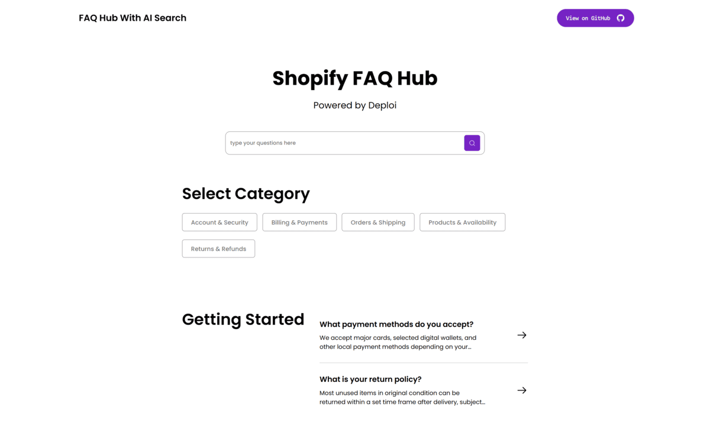

# FAQ Hub with AI Search

A Sanity-powered FAQ knowledge base with AI-powered search and chatbot capabilities, built with Next.js and CopilotKit.

> **Built by [Deploi](http://deploi.ca/)** - A web development agency that helps you launch modern web solutions faster.



## Demo

Live demo: [https://faq-hub-with-ai-search.vercel.app/](https://faq-hub-with-ai-search.vercel.app/)

## Features

- **AI-Powered Search:** Intelligent search functionality with semantic understanding powered by CopilotKit
- **AI Chatbot:** Context-aware chatbot that helps users find answers using your FAQ content
- **Flexible Content Structure:** Organize FAQs with categories, subcategories, and hierarchical navigation
- **Rich Content Editing:** Portable text editor with support for formatting, links, and embedded media
- **Customizable Homepage:** Build your homepage with drag-and-drop sections (search, featured content, categories, common questions)
- **Related Articles:** Automatically suggest related content to keep users engaged
- **Modern UI:** Clean, responsive design built with Tailwind CSS

## What you'll get

- **Framework:** Next.js 16.0.6 (Pages Router)
- **Content Platform:** Sanity v4.18.0
- **AI Integration:** CopilotKit (defaults to Groq for free tier, supports OpenAI, Anthropic, and other providers)
- **Styling:** Tailwind CSS v4
- **Icons:** React Icons

## Getting Started

### Prerequisites

- Node.js 18+ and npm
- A Sanity account (create one at [sanity.io](https://www.sanity.io))

### Installation

#### 1. Initialize the template

Run the following command to initialize this template:

```shell
npm create sanity@latest -- --template Team-Deploi/faq-hub-with-ai-search
```

Or clone this repository:

```shell
git clone https://github.com/Team-Deploi/faq-hub-with-ai-search
cd faq-hub-with-ai-search
npm install
```

> **Note:** This is a monorepo using npm workspaces. The `npm install` command will install dependencies for both the `frontend` and `studio` workspaces.

#### 2. Configure environment variables

Create a `.env.local` file in the `frontend` directory:

```env
# Required: Sanity Configuration
NEXT_PUBLIC_SANITY_PROJECT_ID=your-project-id
NEXT_PUBLIC_SANITY_DATASET=production
NEXT_PUBLIC_SANITY_API_VERSION=2024-01-01
NEXT_PUBLIC_BASE_URL=http://localhost:3000

# Required: LLM Provider API Key
# Default: Groq (free tier available)
GROQ_API_KEY=your-groq-api-key
# Alternative providers: OPENAI_API_KEY, ANTHROPIC_API_KEY, etc.
# See note below for switching providers

# Optional: Sanity Tokens (for authenticated requests)
SANITY_VIEWER_TOKEN=your-viewer-token
SANITY_EDITOR_TOKEN=your-editor-token

# Optional: Visual Editing (for Sanity Presentation)
NEXT_PUBLIC_SANITY_STUDIO_URL=http://localhost:3333
```

> **LLM Provider:** This template uses Groq by default (free tier available at [console.groq.com](https://console.groq.com)). You can switch to other CopilotKit-supported providers (OpenAI, Anthropic, etc.) by modifying `frontend/pages/api/copilotkit.js`. See the note in "Set up the AI Chatbot" section for details.

Create a `.env` file in the `studio` directory:

```env
# Required
SANITY_STUDIO_PROJECT_ID=your-project-id
SANITY_STUDIO_DATASET=production

# Optional
SANITY_STUDIO_TITLE=FAQ Hub Studio
SANITY_STUDIO_HOSTNAME=localhost
```

#### 3. Run the development servers

From the root directory, start both the frontend and studio:

```shell
npm run dev
```

This will start:
- **Next.js app** at [http://localhost:3000](http://localhost:3000)
- **Sanity Studio** at [http://localhost:3333](http://localhost:3333)

#### 4. Sign in to Sanity Studio

Open [http://localhost:3333](http://localhost:3333) and sign in with your Sanity account. You'll be prompted to log in using Google, GitHub, or email.

#### 5. Import Sample Data (Optional)

To get started quickly with sample content, you can import the provided dataset:

```shell
cd studio
sanity dataset import production.tar.gz production --replace
```

> **Note:** This will replace any existing content in your `production` dataset. If you want to use a different dataset, replace `production` with your dataset name. The sample data includes example FAQ articles, categories, and homepage configuration.

#### 6. Troubleshooting Installation Issues

If you encounter errors while running the project after initializing the template, try clearing the node_modules folders and lock files, then reinstalling:

```shell
rm -rf package-lock.json node_modules studio/package-lock.json studio/node_modules
npm install
```

This removes all installed packages and reinstalls them from scratch.

### Adding Content

#### 1. Create your first FAQ article

1. In Sanity Studio, click **"+ Create"** and select **"Article"**
2. Fill in the required fields:
   - **Title:** The main title of your FAQ
   - **Slug:** Auto-generated from title (or customize)
   - **Excerpt:** Short summary for search results
   - **Body:** Full article content
   - **Category:** Select or create a category
3. Click **"Publish"** to make it live

#### 2. Configure the homepage

1. Navigate to **"Home page"** in the Studio sidebar
2. Add sections to build your homepage:
   - **Search block:** Add AI-powered search functionality
   - **Featured Section:** Highlight important articles
   - **Categories:** Display your FAQ categories
   - **Common Questions:** Show frequently asked questions
3. Arrange sections by dragging and dropping

#### 3. Set up the AI Chatbot

1. Navigate to **"Chatbot"** in the Studio sidebar
2. Configure chatbot settings and instructions
3. The chatbot will use your FAQ articles as knowledge base

> **Note:** The chatbot uses Groq by default (free tier available), but you can switch to any CopilotKit-supported provider. To switch providers, edit `frontend/pages/api/copilotkit.js` and replace `GroqAdapter` with `OpenAIAdapter`, `AnthropicAdapter`, or another supported adapter. See [CopilotKit documentation](https://docs.copilotkit.ai) for all supported providers and adapters.

#### 4. Set up Sanity Embeddings Index (for AI Search)

The AI-powered search uses Sanity's Embeddings Index for semantic search:

1. In Sanity Studio, navigate to the **"Embeddings"** tab
2. Create an embeddings index for your FAQ articles
3. The search will automatically use the embeddings index to find relevant content

> **Learn more:** [Sanity Embeddings Documentation](https://www.sanity.io/docs/embeddings)

### Project Structure

This is a monorepo using npm workspaces:

```
faq-hub-with-ai-search/
├── frontend/              # Next.js application (workspace)
│   ├── components/        # React components
│   │   ├── faq/          # FAQ-specific components
│   │   └── copilot/      # AI chatbot components
│   ├── pages/            # Next.js pages
│   ├── sanity/           # Sanity client and queries
│   └── styles/           # Global styles
├── studio/               # Sanity Studio configuration (workspace)
│   ├── schemaTypes/      # Content schema definitions
│   │   ├── documents/    # Document types (Article, Category, etc.)
│   │   └── objects/      # Object types (sections, blocks)
│   └── structure/        # Studio navigation structure
└── package.json          # Root package.json with workspace scripts
```

### Content Schema

The template includes the following content types:

- **Article:** Individual FAQ articles with rich content
- **Category:** Top-level FAQ categories
- **Home page:** Configurable homepage with customizable sections
- **Category page:** Template for category listing pages
- **Chatbot:** AI chatbot configuration

### Deploying

#### Deploy Sanity Studio

Deploy your Sanity Studio to make it accessible to your team:

```shell
npm run deploy:studio
```

Or from the studio directory:

```shell
cd studio
npm run deploy
```

#### Deploy Next.js App

Deploy your Next.js app to your preferred hosting provider (Vercel, Netlify, etc.):

1. Push your code to GitHub
2. Connect your repository to your hosting provider
3. Set the root directory to `frontend`
4. Configure environment variables in your hosting provider's dashboard
5. Deploy

### Scripts

- `npm run dev` - Start both frontend and studio in development mode
- `npm run dev:frontend` - Start only the Next.js app
- `npm run dev:studio` - Start only Sanity Studio
- `npm run deploy:studio` - Deploy Sanity Studio
- `npm run validate` - Validate template structure

### Resources

- [Sanity Documentation](https://www.sanity.io/docs)
- [Next.js Documentation](https://nextjs.org/docs)
- [CopilotKit Documentation](https://docs.copilotkit.ai)
- [Tailwind CSS Documentation](https://tailwindcss.com/docs)
- [Join the Sanity Community](https://slack.sanity.io)


---


**Built with ❤️ by [Team Deploi](https://github.com/Team-Deploi)**

Learn more about our web development services at [deploi.ca](http://deploi.ca/)

